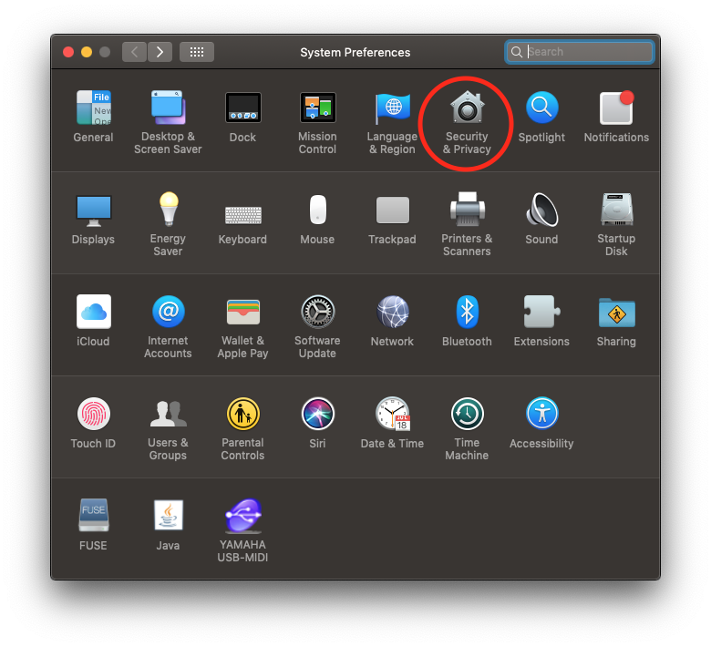
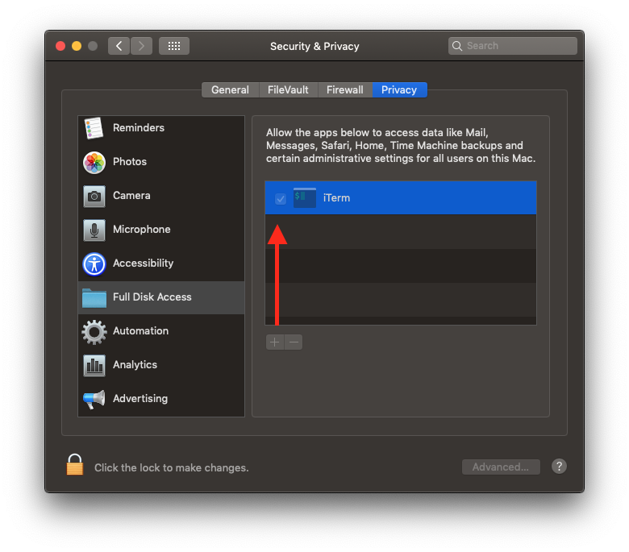
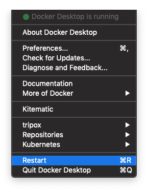

# NFS configuration

In order to speed up performance with Docker for Mac, you can use NFS.

This is only done once.

## 1. Ensure you terminal has full disk access

In order to be able to edit protected files (for NFS), your terminal application
needs full disk access.

 

## 2. Edit `/etc/exports` and add the following line

``` bash
/Users/$USERNAME/$PATH_TO_SITES -mapall=$USERNAME:staff -alldirs localhost
```

This exposes the folder with your sites for NFS.

**REPLACE VARIABLES WITH ACTUAL PATH AND USERNAME**

## 3. Edit `/etc/nfs.conf` and add the following line

``` bash
nfs.server.mount.require_resv_port = 0
```

## 4. Restart NFS daemon

`sudo nfsd restart`

## 5. Restart docker

1. Click on this icon (top right corner) 
2. Click on `Restart`



## 6. docker-compose file configuration

If the project is configured with NFS volumes you are done.

If not, please check the example [here](../../drupal8-example)

**Specifically:**

* [The main docker-compose file](../../drupal8-example/docker-compose.yml)
* [The docker-compose file for macOS](../../drupal8-example/docker-compose-mac.yml)
* [The Makefile](../../drupal8-example/Makefile)
