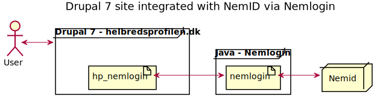

Architecture
============
The project documentation should contain a simple description of the sites architecture. You can also go in depth, but you should _always_ include a general overview.

Use diagrams, and short descriptions. Then link to more in-depth description for the interested reader. [Plantuml](http://plantuml.com) should be used for quick diagramming. Most Editors have plugins for generating previews. You can choose to build the diagrams by hand via the included Makefile and/or use the plantuml github action in the root of this repo.

Sample diagram of a Drupal 7 site that integrates with NemID via a piece of middleware.

